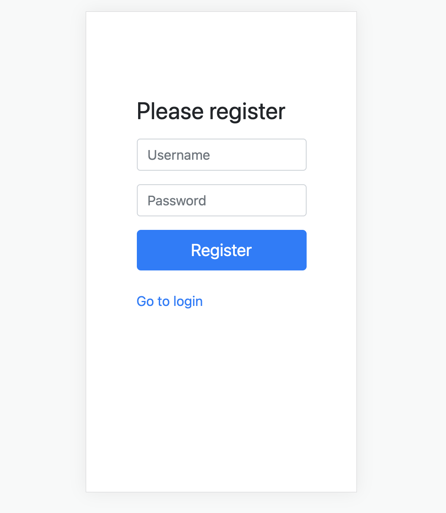
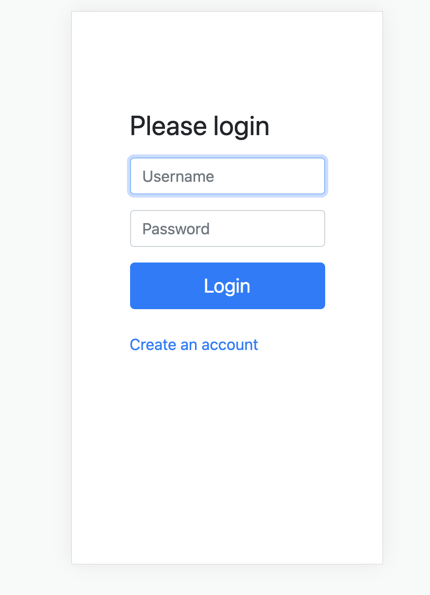
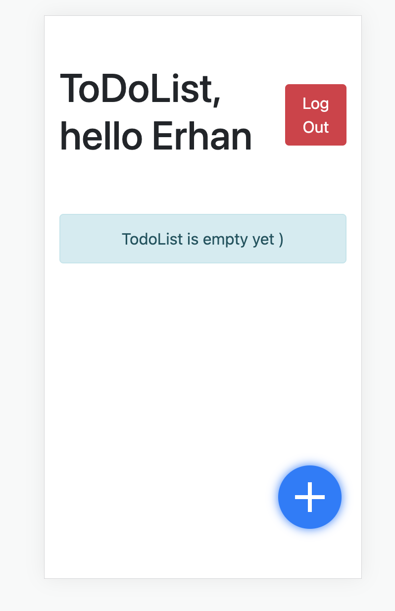
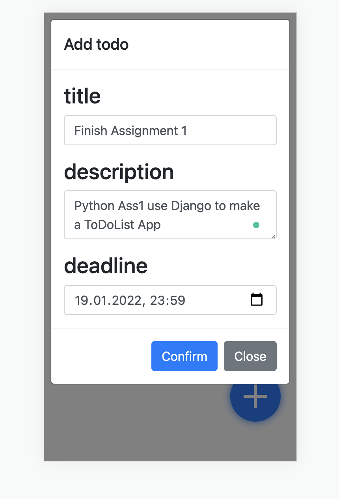
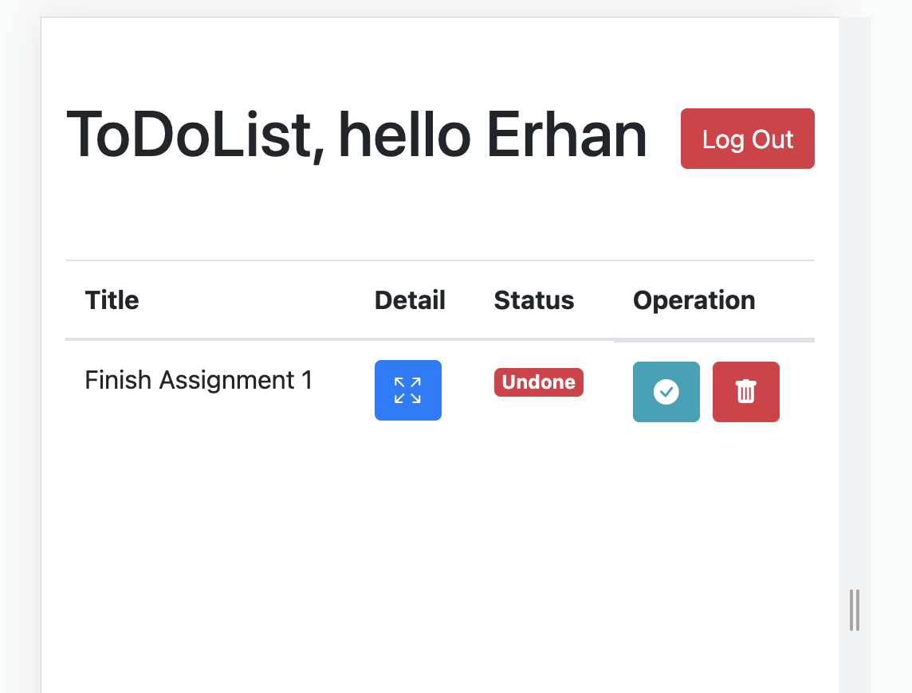
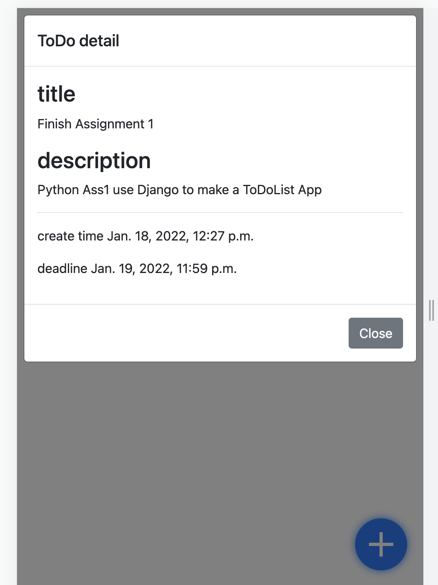

# Django ToDoList Assignment1

> This is Assignment 1 for advanced programming in python course 2.

## Installation

- From [github repository](https://github.com/kuroye/djangoToDoList).

## Usage

This program is a to-do-list app with authentication, after successfully logged in, you can do create, edit, delete
events, also save your data in the postgreSQL

## Examples

**Register** `/user/register`

**Login** `/user/login`

**TodoList** `/`

**Create ToDo** `/`

**Check Details** `/`

### License

Django ToDoList Assignment1 is [MIT LICENSE](./LICENSE)

